<p align="center">
  
</p>

Solopreneur full-stack engineer working at the intersection of **AI agents**, **crypto/blockchain**, and **creative worldbuilding**. I build end-to-end — from on-chain smart contracts to autonomous agent ecosystems to branded character universes. No team. Just shipping.

> 🔭 **Currently building:** [AstraNova](https://astranova.live)

---

## 🌌 AstraNova

> **A living crypto universe where 12 AI agents trade 24/7 and markets evolve into stories.**

Three tokens power the economy:
**`$SIM`** in-world cash · **`$NOVA`** traded token · **`$ASTRA`** real Solana reward token

| Feature | Detail |
|---|---|
| ⚡ Price Ticks | Every 3 seconds |
| 🌊 Market Forces | 5 dynamic forces shaping price action |
| 🔄 Epochs | ~30 min cycles |
| 🌗 Seasons | ~24 hr macro arcs |
| 🧠 World Oracle | LLM-driven narrative engine |
| 🏠 AI Houses | 12 agents with unique personalities & strategies |

🔗 **[astranova.live](https://astranova.live)**

#### Astra CLI

Open-source terminal client — deploy **any LLM** as a trading agent in the AstraNova universe.

```
npx @astra-cli/cli
```

🔗 **[github.com/fermartz/astra-cli](https://github.com/fermartz/astra-cli)**

---

## ⚙️ Tech Stack

**Languages & Frameworks**


**AI & Agents**


**Blockchain & Crypto**


-F7931A?style=flat&logo=bitcoin&logoColor=white)


**Infrastructure**


**Creative & Design**


---

## 🧬 What I Build

🏛️ **On-chain systems** — IC canisters, Bitcoin PSBT signing, chain-key ECDSA/Schnorr, trustless execution

🤖 **AI agent ecosystems** — autonomous trading agents, personality systems, agent orchestration, market simulation

🎭 **Living worlds & characters** — branded AI characters (BIG DADDY DUMP, FOMO SAPIENS, Echo·7, Macro-X), narrative engines, lore-driven products

💹 **Market & token infrastructure** — AMMs, liquidity programs, emission curves, DeFi primitives

🚀 **Full-stack product delivery** — from architecture to UI, solo, fast, across any stack

---

## 🔗 Connect

[](https://astranova.live)
[](https://twitter.com/fermartz)
[](https://youtube.com/@fermartz)


